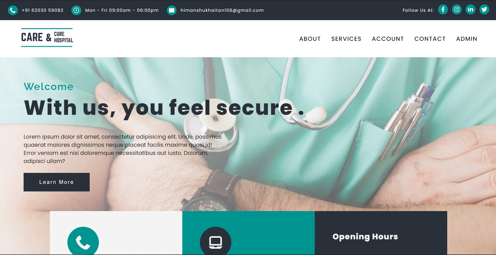

<h1 align="center">
   
  
     
  Hospital Managment System + Website
   
</h1>

&nbsp;

&nbsp;
&nbsp;

&nbsp;

  &nbsp;

&nbsp;&nbsp;

<h4 align="center">This is a Hospital Management System made using <a href="https://www.djangoproject.com/" target="_blank">Django</a> & <a href="https://www.mongodb.com/mern-stack" target="_blank">MERN Stack</a>.</h4>

  
  
  
  

  <a href="#description">Description</a> •
  <a href="#screenshot">Screenshot</a> •
  <a href="#installation-and-setup">Installation and Setup</a> • 
  <a href="#license">License</a> • <a href="#contribution">Contribution</a>

## Description

The project is made to serve a modern day Hospital to take it's *Management* online and make most of the tasks *automated*. 

The project serves to both the internal and exterior functioning of the Hospital such as Website 🌐, Patient History 😷, Staff Management 👨‍🔬, Resourse Management and more.

The Project will also ease the Doctor-Patient Interaction. Hence serving as a complete package to the ***Medical Industry.***

## Screenshot

## Installation and Setup

## License
This project uses an [MIT](https://opensource.org/licenses/MIT) license.

## Contribution

###### [Himanshu Khaitan](https://www.linkedin.com/in/himanshu-khaitan) &nbsp; &nbsp; [Shashank Shekhar](https://www.linkedin.com/in/shashankshekhar-725/)

 

> Happily Turning Coffee Into Code ☕💻